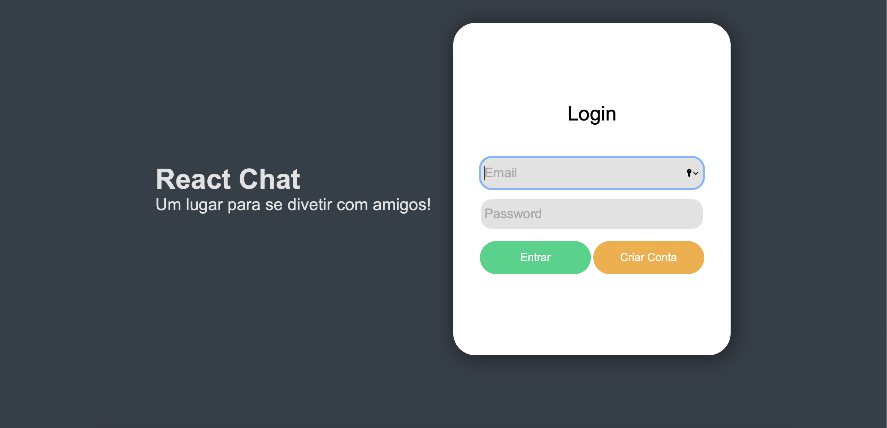

## Chat ReactJS
Um chat em tempo real onde usuarios podem interagir entre si enviando mensagens. 
Para acessar a aplicação [clique aqui.](https://chat-reactjs-front.herokuapp.com)

## 🕹️ Tecnologias Utilizadas
- [React Native](https://reactjs.org)
- [Typescript](https://www.typescriptlang.org)
- [Css](https://developer.mozilla.org/en-US/docs/Web/CSS)
- [Yarn](https://yarnpkg.com/)
- [Heroku](http://heroku.com)
- [Git](https://git-scm.com)

## :rocket: Implementações
 - Criadas Telas de Login e Chat.
 - Conexão com Api do banco de dados.
 - Usuario pode criar uma conta no banco de dados.
 - Usuario pode ver uma lista com todos os usuario.
 - Usuario pode enviar mensagens para outros usuarios da lista.
 - Usuario pode selecionar e enviar emojis.
 - Mensagens são salvas em um banco de dados.
 - Usuario pode sair do chat.
 - Build da aplicação e deploy do github para Heroku.

## Banco de Dados
 A aplicação utiliza seu proprio banco de dados. 
 Você pode acessar o [link do projeto aqui!](https://github.com/felipebaloneker/Chat-ReactJs-Database)!